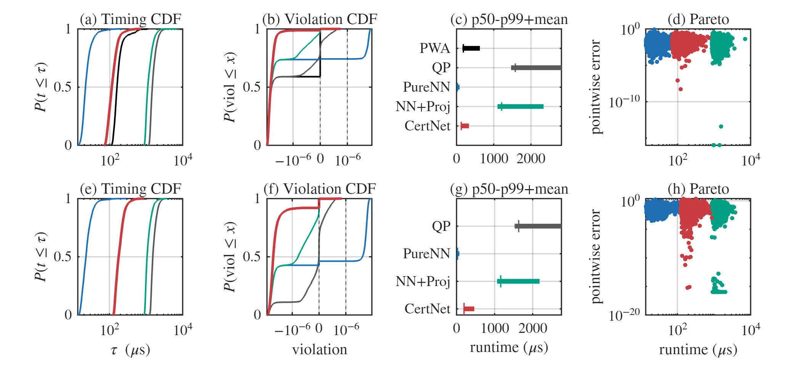
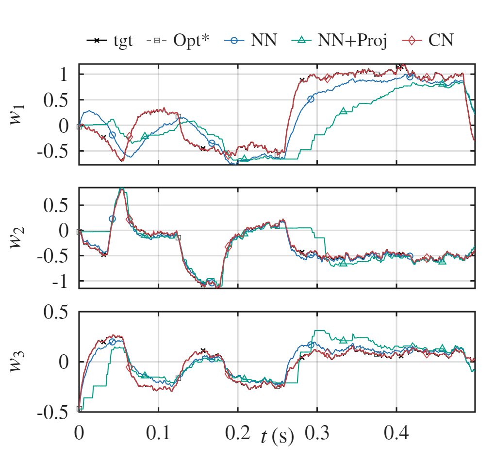
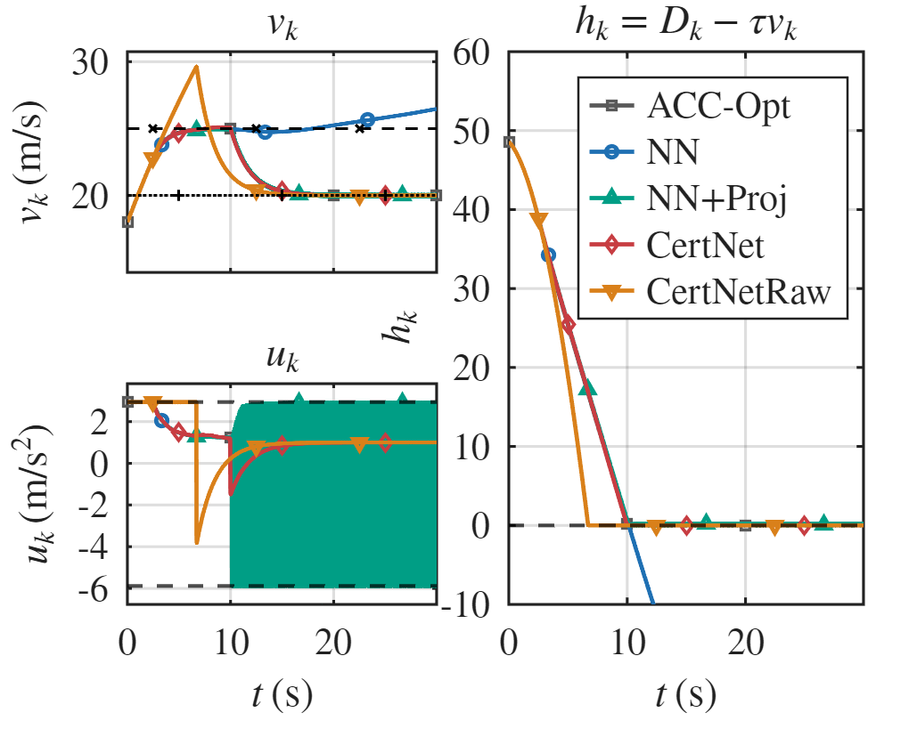

# certnet-control-sim

## Overview
This repository contains the MATLAB implementation of our certified executor / CertNet framework for hard-constrained control with deployable, predictable-latency execution.

The codebase includes:
- a reusable toolbox **`cnet-tb-v1`** for certified library construction and CertNet execution,
- and reproducible experiments for three case studies:
  - mpQP benchmark,
  - control allocation (CA),
  - adaptive cruise control (ACC).

The framework is designed to decouple hard-constraint feasibility from performance learning:
offline, we compile and synthesize certified feasible candidate libraries; online, we execute a fixed-structure algebraic pipeline without iterative optimization.

---

## Repository contents
```text
.
├─ cnet-tb-v1/                              # Core toolbox for certified executor / CertNet
│  ├─ cert/                                 # Certified feasible library construction and querying
│  │  ├─ @Cert/
│  │  │  ├─ Cert.m
│  │  │  ├─ api_build_.m
│  │  │  ├─ api_check_cover_cacheAct_.m
│  │  │  ├─ api_supplement_cacheAct_.m
│  │  │  └─ api_vertices_.m
│  │  ├─ cfg/
│  │  │  └─ set_cert_default_cfg_.m
│  │  └─ query_cache/                       # Cached query structures for fast online lookup
│  │     ├─ cache_append_.m
│  │     ├─ cache_init_.m
│  │     └─ query_.m
│  │
│  ├─ cert-net/                             # CertNet executor and training/inference APIs
│  │  ├─ @Certnet/
│  │  │  ├─ Certnet.m
│  │  │  ├─ api_build_.m
│  │  │  ├─ api_forward_.m
│  │  │  └─ api_train_.m
│  │  ├─ cfg/
│  │  │  └─ set_certnet_cfg_default_.m
│  │  ├─ InterFcn/                          # Interface/export helpers
│  │  │  └─ export_phi_params_.m
│  │  ├─ cvxOpt/                            # Convex/simplex/Carathéodory utilities
│  │  │  ├─ carath_reduce_.m
│  │  │  ├─ convex_rep_ok_.m
│  │  │  ├─ proj_simplex_.m
│  │  │  └─ simplex_ls_.m
│  │  └─ utilFcn/                           # General utility functions
│  │     ├─ getfield_def_.m
│  │     ├─ norm_x_.m
│  │     ├─ simplex_cus.m
│  │     ├─ softplus_.m
│  │     └─ struct_merge_.m
│  │
│  └─ Experiments/                          # Reproducible experiment scripts
│     ├─ sim_ACC/                           # Adaptive Cruise Control (ACC) case study
│     │  ├─ core/                           # ACC experiment functions (test/plot/report)
│     │  │  ├─ acc_plot_.m
│     │  │  ├─ acc_report_.m
│     │  │  └─ acc_test_closedloop_.m
│     │  └─ sim_ACC.mlx                     # Main ACC experiment script
│     │
│     ├─ sim_CA/                            # Control Allocation (CA) case study
│     │  ├─ core/                           # CA experiment functions (test/plot/report)
│     │  │  ├─ ca_plot_.m
│     │  │  ├─ ca_report_.m
│     │  │  └─ ca_test_sync_inject_.m
│     │  └─ sim_CA.mlx                      # Main CA experiment script
│     │
│     ├─ sim_mpQP/                          # mpQP benchmark experiments
│     │  ├─ core/                           # mpQP experiment functions (build/test/plot/report)
│     │  │  ├─ mpqp_build_baseline_.m
│     │  │  ├─ mpqp_gen_trainingData.m
│     │  │  ├─ mpqp_make_problem_.m
│     │  │  ├─ mpqp_plot_problem2_.m
│     │  │  ├─ mpqp_report_problem_.m
│     │  │  └─ mpqp_test_problem_.m
│     │  └─ sim_mpqp.mlx                    # Main mpQP experiment script
│     │
│     └─ tmpFcns/                           # Shared temporary/helper functions for experiments
│        ├─ build_pureNN_.m
│        ├─ net_to_alg_.m
│        └─ pure_nn_forward_alg_.m
│
├─ Figures/                                 # Exported paper-ready figures
│  ├─ sim_ACC.pdf
│  ├─ sim_CA.pdf
│  └─ sim_mpQP.pdf
│
├─ ACC_vars_2026-02-20_101044.mat           # Saved ACC experiment variables/results
├─ CA_vars_2026-02-20_104948.mat            # Saved CA experiment variables/results
├─ MPQP_vars_2026-02-20_160236.mat          # Saved mpQP experiment results
└─ README.md
```

> **Notes**
> - This repository provides our toolbox implementation, **`cnet-tb-v1`**, which fully realizes the framework and experimental pipeline presented in the paper.
> - The toolbox includes the main certified-library and CertNet components, as well as the experiment modules used to reproduce the reported results.
> - The folders `cvxOpt/` and `utilFcn/` contain supporting convex-geometry and basic mathematical utilities used by the implementation. These functions serve as foundational building blocks, but they are not unique to the method and may be replaced by improved implementations or alternative computational pipelines.

---
## Quick start

1. Download or clone this repository, and keep the folder structure unchanged.
2. Open MATLAB and set the current folder to the repository root.
3. Add the repository root and all subfolders to the MATLAB path.
4. Run the following three live scripts to reproduce all results reported in the paper (including figures, tables, and intermediate logs/process information):
   * `cnet-tb-v1/Experiments/sim_mpQP/sim_mpqp.mlx`
   * `cnet-tb-v1/Experiments/sim_CA/sim_CA.mlx`
   * `cnet-tb-v1/Experiments/sim_ACC/sim_ACC.mlx`
  
### Reproducing figures/reports from saved data (optional)

If you only want to reproduce the reported figures/tables without rerunning the full simulations:

1. Load the corresponding saved `.mat` file in MATLAB (e.g., `MPQP_vars_*.mat`, `CA_vars_*.mat`, `ACC_vars_*.mat`).
2. Run the associated `report` and `plot` functions in the corresponding experiment `core/` folder.

> **Notes**
> * This repository includes saved simulation data used in the paper, containing the required parameters and baseline outputs for reproduction.
> * Full simulation runs automatically save data with timestamped filenames, so the saved data used in the paper are not overwritten.
> * Exported paper-ready figures are saved to `Figures/`.

**Environment (reproducibility).**  
- **OS:** Windows 11  
- **CPU:** 11th Gen Intel(R) Core(TM) i7-11850H @ 2.50GHz  
- **MATLAB:** R2025a (25.1.0.2943329)  
- **Solvers/Libraries:** MOSEK 11.0.27; YALMIP 20250626; MPT3 3.2.1
- MATLAB toolboxes: omitted for brevity (MATLAB will report any missing product dependencies at runtime).

## Features

## Features

> **GitHub preview note:** GitHub does not preview PDF figures inline in README.  
> This repository includes **paper-ready PDF** figures in `Figures/` and can additionally include **PNG previews** (recommended) for direct viewing on GitHub.

### 1) mpQP benchmark: latency–feasibility–fidelity trade-off under controlled scaling

**What to look for:**  
This benchmark isolates deployment trade-offs under systematic scaling and compares five method classes (QP / PWA / PureNN / NN+Proj / CertNet).  
The key observations are:

- **CertNet preserves hard feasibility** (0% violation rate up to numerical tolerance) like NN+Proj/PWA, while avoiding online projection solves.
- **CertNet reduces runtime (mean / p50 / p99)** relative to QP and NN+Proj, including tail latency.
- In the larger-scale setting (S2), **explicit PWA compilation times out**, while CertNet remains deployable through certified library compilation + active sublibrary execution.

**Representative quantitative results (from the paper tables):**
- **S1 (mpQP):** CertNet achieves **13.43×** mean-latency speedup over QP, with **0% hard-feasibility violation rate**.
- **S2 (mpQP):** CertNet achieves **8.76×** mean-latency speedup over QP, with **0% hard-feasibility violation rate**.
- PWA is available in S1 but **unavailable in S2** under the same offline compilation budget.

**Included outputs (paper figures/tables):**
- Offline scale / deployability summary (library sizes, PWA availability)
- Aggregate result table (timing, feasibility, fidelity)
- Diagnostic figure: runtime CDF, violation CDF, timing summary, and runtime–error trade-off

**Figure preview (mpQP diagnostics)**  
*(recommended preview image: export a PNG from `Figures/sim_mpQP.pdf`, e.g., `Figures/sim_mpQP.png`)*
<p align="center">
  <br>
  <b>mpQP diagnostics (two settings): runtime CDF, violation CDF, timing summary, and runtime–error trade-off</b>
</p>

---

### 2) Control Allocation (CA): deadline-aware deployment behavior (hold-on-timeout)

**What to look for:**  
The CA benchmark stresses **real-time deployment semantics** under a sampling deadline.  
At each step, if runtime exceeds the sampling budget, the controller applies a **hold action** (no new command injection). This makes runtime tails directly affect closed-loop performance.

Key observations:

- **PureNN** is fast but can violate hard constraints.
- **NN+Proj** restores feasibility but still suffers from solver-like latency and deadline misses.
- **CertNet** preserves hard feasibility and achieves a much lower runtime tail, which translates into **0% timeout rate** in the reported setting and much stronger closed-loop tracking.

**Representative quantitative results (from the paper table):**
- **CA (Ts = 1000 μs):**
  - **CertNet:** mean/p99 runtime = **217.2 / 680.8 μs**, **0% timeout rate**, **0% feasibility violation rate**
  - **NN+Proj:** mean/p99 runtime = **1271.2 / 3590.1 μs**, **56.60% timeout rate**
  - **Opt:** mean/p99 runtime = **1521.9 / 4142.6 μs**, **100% timeout rate** under deploy-time deadline semantics

**Included outputs (paper figures/tables):**
- Closed-loop aggregate result table (timing, timeout rate, feasibility, tracking metric)
- Closed-loop trajectory figure under deadline-based execution
- (Optional) “ideal Opt” / oracle reference curve for timing-free comparison

**Figure preview (CA closed-loop trajectories)**  
*(recommended preview image: export a PNG from `Figures/sim_CA.pdf`, e.g., `Figures/sim_CA.png`)*
<p align="center">
  <br>
  <b>Control Allocation (CA): closed-loop trajectories under deadline (hold-on-timeout) execution</b>
</p>

---

### 3) Adaptive Cruise Control (ACC): CLF/CBF-style safety filtering with timing-only runtime evaluation

**What to look for:**  
The ACC benchmark evaluates a safety-critical CLF/CBF-style filtering setup, where hard constraints include input bounds, safety constraints, and one-step state bounds.  
Unlike CA, runtime is **measured but not injected** into the state update (timing-only protocol), so the comparison isolates controller quality under the same closed-loop dynamics.

Key observations:

- **CertNet** matches the feasible teacher / NN+Proj closed-loop performance level while running much faster.
- **PureNN** is fast but shows frequent hard-constraint violations.
- The structural feasibility property is visible even with an untrained/raw CertNet variant in the tested regime (if included in the plot).

**Representative quantitative results (from the paper table):**
- **ACC (Ts = 20 ms):**
  - **CertNet:** mean/p99 runtime = **81.2 / 168.2 μs**, **0% feasibility violation rate**, mean cost matches feasible baselines
  - **Opt:** mean/p99 runtime = **897.3 / 1425.4 μs**
  - **NN+Proj:** mean/p99 runtime = **800.6 / 1449.4 μs**
  - **PureNN:** fast but **66.27%** feasibility violation rate

**Included outputs (paper figures/tables):**
- Closed-loop aggregate result table (timing, feasibility, performance)
- Closed-loop trajectory figure (speed, acceleration, safety margin)
- Timing statistics measured on representative deploy-time inputs

**Figure preview (ACC closed-loop trajectories)**  
*(recommended preview image: export a PNG from `Figures/sim_ACC.pdf`, e.g., `Figures/sim_ACC.png`)*
<p align="center">
  <br>
  <b>Adaptive Cruise Control (ACC): closed-loop speed, acceleration, and safety margin under timing-only evaluation</b>
</p>

---

### 4) Reproducibility and outputs included

This repository provides not only the toolbox implementation (`cnet-tb-v1`) but also the full experiment pipeline and outputs used in the paper:

- **Reusable toolbox modules**
  - `cert/`: certified feasible library construction and querying
  - `cert-net/`: CertNet executor, training, and inference APIs
- **Reproducible experiment scripts**
  - `sim_mpQP.mlx`, `sim_CA.mlx`, `sim_ACC.mlx`
- **Saved experiment data (`*.mat`)**
  - Includes the key variables/outputs needed to reproduce the reported figures and tables
  - Full simulation runs save timestamped files (to avoid overwriting the paper snapshots)
- **Paper-ready figures**
  - `Figures/sim_mpQP.pdf`
  - `Figures/sim_CA.pdf`
  - `Figures/sim_ACC.pdf`

> If you only want to reproduce the reported figures/tables, load the corresponding saved `.mat` file and run the associated `report` / `plot` functions in each experiment `core/` folder.
